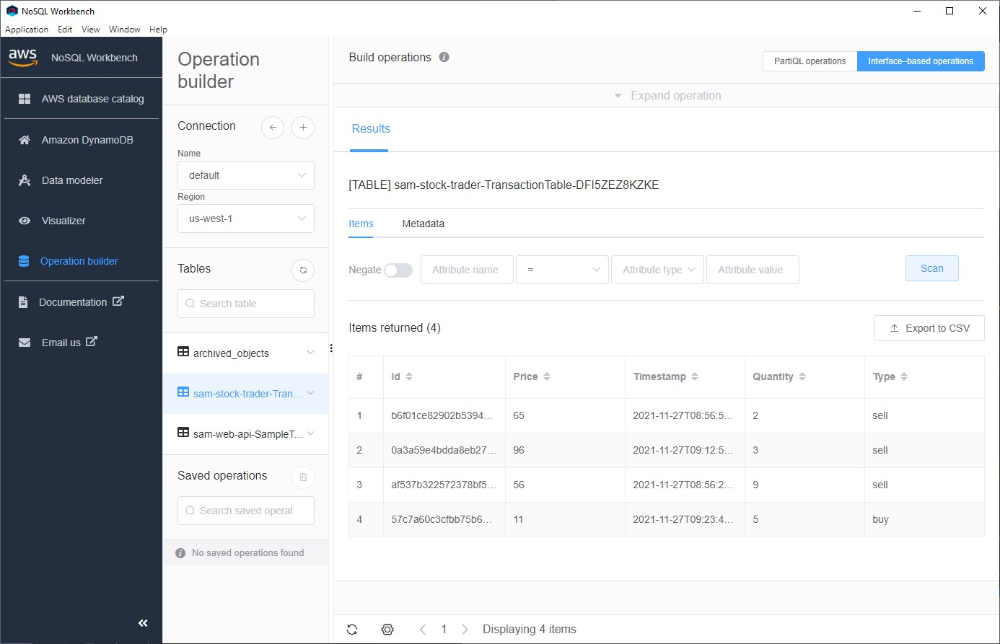

# sam-stock-trader
Learn AWS Step Functions, a Workflow app.
* [Step Functions Overview](https://youtu.be/1RJtCKpdELQ)

## 1. Deploy the Step Functions
* Open the command pallette `ctl-shift-p`, then type `aws:`. Select *"AWS: Deploy SAM Application"*

```log
2021-11-27 00:43:30 [INFO]: Deploying SAM Application to CloudFormation Stack: sam-stock-trader
2021-11-27 00:43:30 [INFO]: Running command: (not started) [C:\Program Files\Amazon\AWSSAMCLI\bin\sam.cmd deploy --template-file C:\Users\WRY\AppData\Local\Temp\aws-toolkit-vscode\samDeploy4VYlnV\template.yaml --stack-name sam-stock-trader --capabilities CAPABILITY_IAM CAPABILITY_NAMED_IAM CAPABILITY_AUTO_EXPAND --region us-west-1 --s3-bucket sam.hello]
2021-11-27 00:43:31 [INFO]: 
	Deploying with following values
	===============================
	Stack name                   : sam-stock-trader
	Region                       : us-west-1
	Confirm changeset            : False
	Disable rollback             : False
	Deployment s3 bucket         : sam.hello
	Capabilities                 : ["CAPABILITY_IAM", "CAPABILITY_NAMED_IAM", "CAPABILITY_AUTO_EXPAND"]
	Parameter overrides          : {}
	Signing Profiles             : {}

2021-11-27 00:43:31 [INFO]: 
Initiating deployment
=====================

2021-11-27 00:43:31 [INFO]: 
Uploading to f2ca7c7046c4cb052ad17a5c73840369.template  2800 / 2800  (100.00%)
2021-11-27 00:43:32 [INFO]: 
Waiting for changeset to be created..

2021-11-27 00:43:42 [INFO]: 
CloudFormation stack changeset
-------------------------------------------------------------------------------------------------
Operation                LogicalResourceId        ResourceType             Replacement            
-------------------------------------------------------------------------------------------------

2021-11-27 00:43:42 [INFO]: + Add                    StockBuyerFunctionRole   AWS::IAM::Role           N/A                    
+ Add                    StockBuyerFunction       AWS::Lambda::Function    N/A                    
+ Add                    StockCheckerFunctionRo   AWS::IAM::Role           N/A                    
                         le                                                                       

2021-11-27 00:43:42 [INFO]: + Add                    StockCheckerFunction     AWS::Lambda::Function    N/A                    
+ Add                    StockSellerFunctionRol   AWS::IAM::Role           N/A                    
                         e                                                                        
+ Add                    StockSellerFunction      AWS::Lambda::Function    N/A                    
+ Add                    StockTradingStateMachi   AWS::IAM::Role           N/A                    
                         neHourlyTradingSchedul                                                   
                         eRole                                                                    
+ Add                    StockTradingStateMachi   AWS::Events::Rule        N/A                    
                         neHourlyTradingSchedul                                                   
                         e                                                                        
+ Add                    StockTradingStateMachi   AWS::IAM::Role           N/A                    
                         neRole                                                                   
+ Add                    StockTradingStateMachi   AWS::StepFunctions::St   N/A                    
                         ne                       ateMachine                                      
+ Add                    TransactionTable         AWS::DynamoDB::Table     N/A                    
-------------------------------------------------------------------------------------------------

Changeset created successfully. arn:aws:cloudformation:us-west-1:450837389776:changeSet/samcli-deploy1638002611/7cc7d68d-1aa2-49f3-806e-6de3ea060a6f


2021-11-27 00:43:42 [INFO]: 
2021-11-27 00:43:42 - Waiting for stack create/update to complete

2021-11-27 00:43:42 [INFO]: 
CloudFormation events from stack operations
-------------------------------------------------------------------------------------------------
ResourceStatus           ResourceType             LogicalResourceId        ResourceStatusReason   
-------------------------------------------------------------------------------------------------

2021-11-27 00:43:46 [INFO]: CREATE_IN_PROGRESS       AWS::IAM::Role           StockCheckerFunctionRo   -                      
                                                  le                                              
CREATE_IN_PROGRESS       AWS::IAM::Role           StockSellerFunctionRol   -                      

2021-11-27 00:43:46 [INFO]:                                                   e                                               
CREATE_IN_PROGRESS       AWS::DynamoDB::Table     TransactionTable         -                      

2021-11-27 00:43:47 [INFO]: CREATE_IN_PROGRESS       AWS::IAM::Role           StockCheckerFunctionRo   Resource creation      
                                                  le                       Initiated              

2021-11-27 00:43:47 [INFO]: CREATE_IN_PROGRESS       AWS::IAM::Role           StockBuyerFunctionRole   -                      
CREATE_IN_PROGRESS       AWS::DynamoDB::Table     TransactionTable         Resource creation      
                                                                           Initiated              
CREATE_IN_PROGRESS       AWS::IAM::Role           StockSellerFunctionRol   Resource creation      
                                                  e                        Initiated              

2021-11-27 00:43:47 [INFO]: CREATE_IN_PROGRESS       AWS::IAM::Role           StockBuyerFunctionRole   Resource creation      
                                                                           Initiated              

2021-11-27 00:44:01 [INFO]: CREATE_COMPLETE          AWS::IAM::Role           StockBuyerFunctionRole   -                      
CREATE_COMPLETE          AWS::IAM::Role           StockSellerFunctionRol   -                      
                                                  e                                               
CREATE_COMPLETE          AWS::IAM::Role           StockCheckerFunctionRo   -                      
                                                  le                                              

2021-11-27 00:44:02 [INFO]: CREATE_IN_PROGRESS       AWS::Lambda::Function    StockSellerFunction      -                      

2021-11-27 00:44:03 [INFO]: CREATE_IN_PROGRESS       AWS::Lambda::Function    StockCheckerFunction     -                      
CREATE_IN_PROGRESS       AWS::Lambda::Function    StockBuyerFunction       -                      

2021-11-27 00:44:04 [INFO]: CREATE_IN_PROGRESS       AWS::Lambda::Function    StockSellerFunction      Resource creation      
                                                                           Initiated              

2021-11-27 00:44:05 [INFO]: CREATE_IN_PROGRESS       AWS::Lambda::Function    StockCheckerFunction     Resource creation      
                                                                           Initiated              

2021-11-27 00:44:06 [INFO]: CREATE_IN_PROGRESS       AWS::Lambda::Function    StockBuyerFunction       Resource creation      
                                                                           Initiated              

2021-11-27 00:44:12 [INFO]: CREATE_COMPLETE          AWS::Lambda::Function    StockSellerFunction      -                      

2021-11-27 00:44:13 [INFO]: CREATE_COMPLETE          AWS::Lambda::Function    StockCheckerFunction     -                      

2021-11-27 00:44:18 [INFO]: CREATE_COMPLETE          AWS::DynamoDB::Table     TransactionTable         -                      

2021-11-27 00:44:27 [INFO]: CREATE_COMPLETE          AWS::Lambda::Function    StockBuyerFunction       -                      

2021-11-27 00:44:29 [INFO]: CREATE_IN_PROGRESS       AWS::IAM::Role           StockTradingStateMachi   -                      
                                                  neRole                                          

2021-11-27 00:44:29 [INFO]: CREATE_IN_PROGRESS       AWS::IAM::Role           StockTradingStateMachi   Resource creation      
                                                  neRole                   Initiated              

2021-11-27 00:44:46 [INFO]: CREATE_COMPLETE          AWS::IAM::Role           StockTradingStateMachi   -                      
                                                  neRole                                          

2021-11-27 00:44:49 [INFO]: CREATE_IN_PROGRESS       AWS::StepFunctions::St   StockTradingStateMachi   -                      
                         ateMachine               ne                                              

2021-11-27 00:44:52 [INFO]: CREATE_IN_PROGRESS       AWS::StepFunctions::St   StockTradingStateMachi   Resource creation      
                         ateMachine               ne                       Initiated              

2021-11-27 00:44:53 [INFO]: CREATE_COMPLETE          AWS::StepFunctions::St   StockTradingStateMachi   -                      
                         ateMachine               ne                                              

2021-11-27 00:44:55 [INFO]: CREATE_IN_PROGRESS       AWS::IAM::Role           StockTradingStateMachi   -                      
                                                  neHourlyTradingSchedul                          
                                                  eRole                                           

2021-11-27 00:44:55 [INFO]: CREATE_IN_PROGRESS       AWS::IAM::Role           StockTradingStateMachi   Resource creation      
                                                  neHourlyTradingSchedul   Initiated              

2021-11-27 00:44:55 [INFO]:                                                   eRole                                           

2021-11-27 00:45:10 [INFO]: CREATE_COMPLETE          AWS::IAM::Role           StockTradingStateMachi   -                      
                                                  neHourlyTradingSchedul                          

2021-11-27 00:45:10 [INFO]:                                                   eRole                                           

2021-11-27 00:45:12 [INFO]: CREATE_IN_PROGRESS       AWS::Events::Rule        StockTradingStateMachi   -                      
                                                  neHourlyTradingSchedul                          
                                                  e                                               

2021-11-27 00:45:12 [INFO]: CREATE_IN_PROGRESS       AWS::Events::Rule        StockTradingStateMachi   Resource creation      
                                                  neHourlyTradingSchedul   Initiated              
                                                  e                                               

2021-11-27 00:46:13 [INFO]: CREATE_COMPLETE          AWS::Events::Rule        StockTradingStateMachi   -                      
                                                  neHourlyTradingSchedul                          

2021-11-27 00:46:13 [INFO]:                                                   e                                               

2021-11-27 00:46:15 [INFO]: CREATE_COMPLETE          AWS::CloudFormation::S   sam-stock-trader         -                      
                         tack                                                                     

2021-11-27 00:46:15 [INFO]: -------------------------------------------------------------------------------------------------

2021-11-27 00:46:15 [INFO]: 
CloudFormation outputs from deployed stack
-------------------------------------------------------------------------------------------------
Outputs                                                                                         

2021-11-27 00:46:15 [INFO]: -------------------------------------------------------------------------------------------------
Key                 StockTradingStateMachineArn                                                 
Description         Stock Trading state machine ARN                                             
Value               arn:aws:states:us-                                                          
west-1:450837389776:stateMachine:StockTradingStateMachine-m001toWVAJjN                          

Key                 StockTradingStateMachineRole                                                
Description         IAM Role created for Stock Trading state machine based on the specified SAM 
 Policy Templates                                                                               
Value               arn:aws:iam::450837389776:role/sam-stock-trader-                            
StockTradingStateMachineRole-1MP7F91Q0KRS1                                                      
-------------------------------------------------------------------------------------------------

Successfully created/updated stack - sam-stock-trader in us-west-1


2021-11-27 00:46:15 [INFO]: 

2021-11-27 00:46:15 [INFO]: Successfully deployed SAM Application to CloudFormation Stack: sam-stock-trader
```

## 2. Execute the Workflow
* [Workflow](./statemachine/stock_trader.asl.json)
* Start Execution

* Check the transactions
